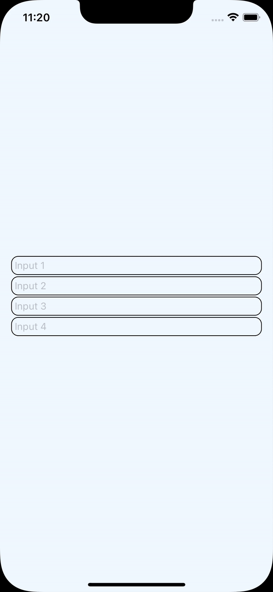

# @alcs/react-native-input-autofocus

> Support for next input focusing functionality

## Introduction

This package simplifies the focus system on the next input.

<table>
<thead>
<tr>
<th>
iOS
</th>
<th>
Android
</th>
</tr>
</thead>
<tbody>
<tr>
<td>



</td>
<td>


</td>
</tr>
</tbody>

</table>

## Installation

-   Using npm

```
npm i @alcs/react-native-input-autofocus
```

-   Using yarn

```
yarn add @alcs/react-native-input-autofocus
```

-   Using pnpm

```
pnpm add @alcs/react-native-input-autofocus
```

## Usage

-   Create or add to your `<Input />` component.

```tsx{3,6,14}
import React, { useState } from 'react';
import { StyleSheet, TextInput, TextInputProps } from 'react-native';
import { useInputFocusController } from '@alcs/react-native-input-autofocus'; // [!code focus]

export const Input = (props: TextInputProps) => {
    const focusController = useInputFocusController(); // [!code focus]

    const [typedValue, setTypedValue] = useState('');

    return (
        <TextInput
            onChangeText={setTypedValue}
            value={typedValue}
            {...focusController} // [!code focus]
            {...props}
        />
    );
};
```

-   Wrap component where you want to add auto focus.

```tsx{4,8,15}
import React from 'react';
import { Input } from './Input';
import { View } from 'react-native';
import { InputFocusController } from '@alcs/react-native-input-autofocus'; // [!code focus]

export const YourPage = () => {
    return (
         <InputFocusController> // [!code focus]
            <View>
                <Input placeholder="Input 1" />
                <Input placeholder="Input 2" />
                <Input placeholder="Input 3" />
                <Input placeholder="Input 4" />
            </View>
        </InputFocusController> // [!code focus]
    );
};
```

## License

MIT © [Aleksandras Bogdanovas <aleksandras.bogdanovas21@gmail.com>](https://github.com/Aleksandriukas)
